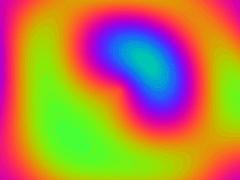
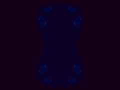
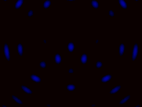
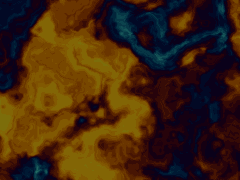
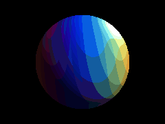
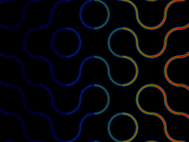
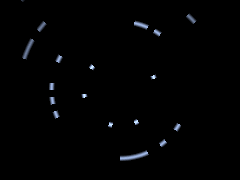
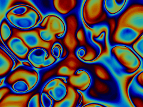

# shadertoy

A little collection of GLSL fragment shaders I've messed around with - wave propagation, fractals, raymarching, and noise. Each `.glsl` is Shadertoy-ready (paste into the editor; uses `iTime` / `iResolution`). GIFs below are short loops captured from each one.

## Gallery

<table>
<tr>
<td align="center" width="33%">
   
  <b>Plasma</b> 
sine-sum field + IQ cosine palette 
  <a href="shaders/plasma.glsl">code</a>
</td>
<td align="center" width="33%">
   
  <b>Julia set</b> 
constant <code>c</code> orbits a circle, so it loops 
  <a href="shaders/julia.glsl">code</a>
</td>
<td align="center" width="33%">
   
  <b>Wave interference</b> 
three point sources, intensity = |sum of waves|^2 
  <a href="shaders/interference.glsl">code</a>
</td>
</tr>
<tr>
<td align="center" width="33%">
   
  <b>Domain warp</b> 
fbm warped by fbm (Inigo Quilez style) 
  <a href="shaders/domain_warp.glsl">code</a>
</td>
<td align="center" width="33%">
   
  <b>Raymarched sphere</b> 
SDF sphere, diffuse + specular, orbiting light 
  <a href="shaders/raymarch_sphere.glsl">code</a>
</td>
<td align="center" width="33%">
   
  <b>Truchet tiles</b> 
random arc orientation per cell, glowing 
  <a href="shaders/truchet.glsl">code</a>
</td>
</tr>
<tr>
<td align="center" width="33%">
   
  <b>Warp starfield</b> 
layered depth, hash-placed stars 
  <a href="shaders/starfield.glsl">code</a>
</td>
<td align="center" width="33%">
   
  <b>Gyroid</b> 
raymarched implicit surface, glow accumulation 
  <a href="shaders/gyroid.glsl">code</a>
</td>
<td align="center" width="33%"></td>
</tr>
</table>

## the physics and math hiding in here

honestly half of these are just my physics and math classes wearing a costume (°◡°♡). a couple of side-by-sides, the shader next to the actual sim:

**wave interference.** the interference shader is the same thing i simulated for my optics lab: a few point sources, brightness = the squared magnitude of the summed waves. shader on the left, the real diffraction sim (from my python-junk repo) on the right.

<table>
<tr>
<td align="center"> interference.glsl (GPU, real-time)</td>
<td align="center"> the real double-slit sim (python-junk)</td>
</tr>
</table>

**fractals / complex dynamics.** the julia shader iterates z -> z^2 + c with c fixed. its cousin the mandelbrot set runs the same iteration but fixes the start and varies c. same escape-time idea, different knob.

<table>
<tr>
<td align="center"> julia.glsl</td>
<td align="center"> mandelbrot (python-junk)</td>
</tr>
</table>

and the rest, quickly:

| shader | what it's secretly doing |
|--------|--------------------------|
| plasma | a sum of sine waves. superposition, same as stacking harmonics |
| domain_warp | fbm noise warped by more fbm. self-similar / fractal, like turbulence |
| raymarch_sphere | a signed distance field plus sphere tracing, then phong shading, which is just how light reflects off a surface (a diffuse term and a shiny highlight) |
| gyroid | a real triply-periodic minimal surface: sin x cos y + sin y cos z + sin z cos x = 0 |
| truchet | truchet tiling, basically a coin flip of orientation per tile |
| starfield | layered parallax with 1/z perspective depth |

## notes
shader cheatsheet and per-technique writeups, since i kept relearning this stuff:
- [`notes-to-self.md`](notes-to-self.md) - the shadertoy uniforms, the palette one-liner, gotchas
- [`docs/palettes.md`](docs/palettes.md) - the iq cosine palette
- [`docs/raymarching.md`](docs/raymarching.md) - SDF sphere tracing (sphere + gyroid)
- [`docs/noise.md`](docs/noise.md) - fbm + domain warping
- [`docs/capturing-loops.md`](docs/capturing-loops.md) - making a seamless gif loop

## Older sketches
`sine.glsl`, `water-waves.glsl`, `rainbow-gradient.glsl`, `matrix.glsl`, `duck.glsl`

## Run
Paste any shader into <https://www.shadertoy.com/new>, or run locally with a GLSL viewer (glslViewer, VS Code shader extensions, etc.).
